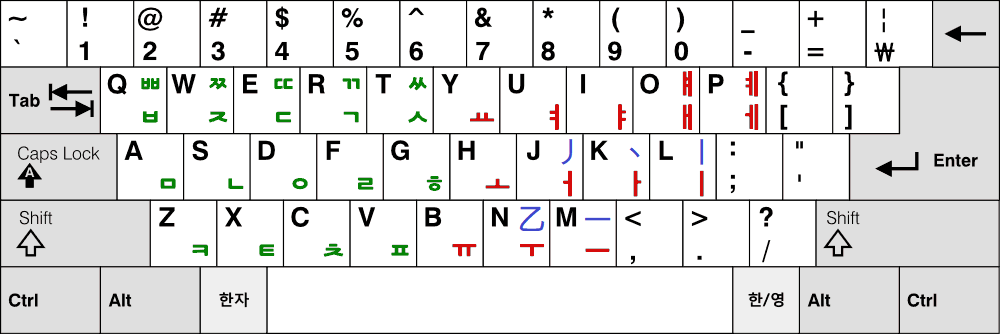

# 韓官話　Handarin 
配方： ℞ **rime-handarin**
> 用韓字寫中文官話！／Use Korean Hangul to Write Chinese Mandarin!
>
> 한국한자음으로 중국어를 입력하는 가장 간단한 Rime 수입방안

[Rime](https://rime.im) 拼音輸入方案

## 用韓字 寫官話一下！
➡️ [Example Page](https://handarin-courses.vercel.app/learn-13-drink-%EC%9D%8C%EB%A3%8C-%E5%96%9D%EF%BC%8C%E6%B0%B4%EF%BC%8C%E8%8C%B6%EF%BC%8C%E6%9E%9C%E6%B1%81%EF%BC%8C%E5%92%96%E5%95%A1%EF%BC%8C%E5%95%A4%E9%85%92%EF%BC%8C%E8%AF%B7%E9%97%AE) ⬅️

## 安裝　안장　Install
[東風破](https://github.com/rime/plum) 安裝口令： `bash rime-install picado-tv/rime-handarin`

授權條款：見 [LICENSE](LICENSE)

## 特點　특점　Features
1. 雙手輸入（世界最初）👐
2. 韓流文化　🇰🇷
3. 世宗大王的恩寵　👼🏻

## 注意　주의　Caution
你可以使用古代漢字或者韓式漢字詞，但因爲本輸入法爲主官話白話文最優化了，所以結果可能不滿意。

## 用法　용법　Usages

* 韓式漢字音閱覽：[Naver Hanja Dict](https://hanja.dict.naver.com/)
* 從中文到韓式漢字音變換器：[Mandarin to Handarin Converter](https://colab.research.google.com/drive/13SFMjKA2ZUqeweST2778SA1a1-770hof?usp=sharing)

#### Handarin Keyboard Layout

* 綠色：韓文的初聲和終聲的。相應於英文的「Consonant」的。
* 紅色：韓文的中聲。相應於英文的「Vowel」的。
* 藍色：韓官話式五筆畫。「丿」和「Ｊ」相似，「乙」和「Ｎ」相似。「ｌ」豎立，「ｍ」橫最長，「Ｋ」有「↘️方」筆畫。不管怎樣，它們在很附近。

## 例　예　Examples
#### 你好：`slgh` 或者 `JLJNLJK NJMNLM`

## 功勞　공로　Credits

* The dictionary is derived work from the one from [地球拼音](https://github.com/rime/rime-terra-pinyin) + [五筆畫](https://github.com/rime/rime-stroke)
